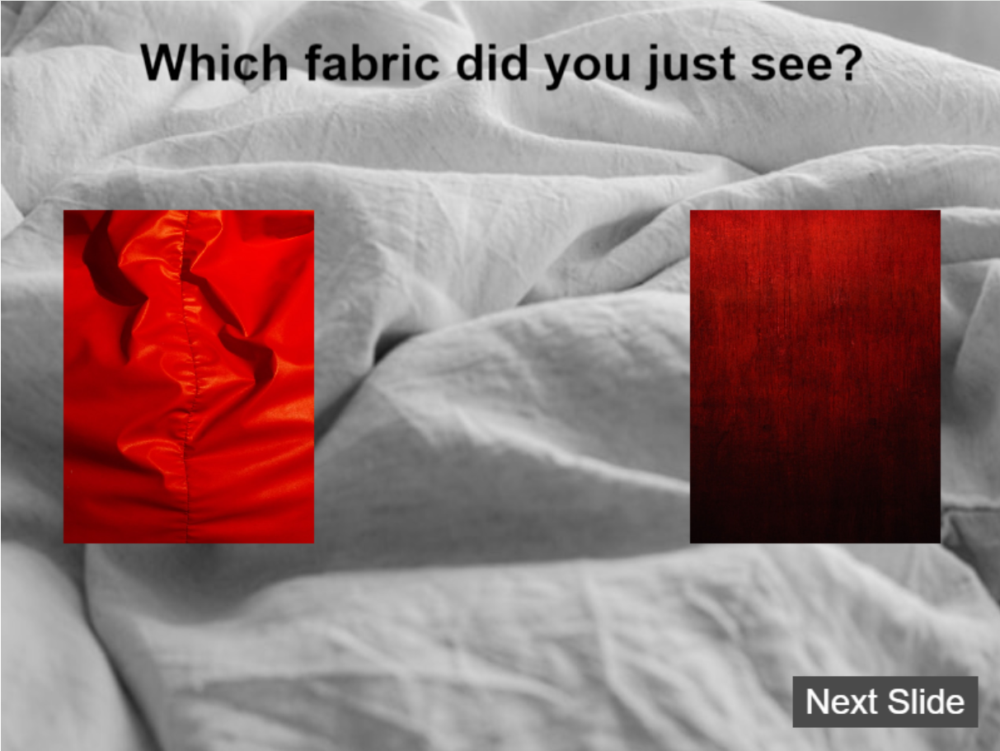

# Annis Textile Mania

## Overview

**"Annis Textile Mania"** is an interactive and educational game that dives into the history and journey of textile manufacturing, focusing on the evolution of fabric production, global trade, and the significance of textiles in different cultures. Through engaging gameplay and vibrant visuals, players will explore the intricate world of textiles—from traditional weaving techniques to modern textile technology—while learning about the economic and cultural impact of this industry.

## Internship Project

This game is part of an internship project aimed at creating an immersive, educational experience using **Rosebud AI** and the **Phaser** game framework. The primary objective is to merge technology and creativity to create a meaningful educational tool while developing both technical and storytelling skills.

## Features

- **Educational Content**: Learn about the history and impact of textile manufacturing across different cultures and eras.
- **Interactive Gameplay**: Navigate through different periods of textile production, from hand looms to modern machines.
- **Cultural Design**: Experience a diverse array of textiles with rich visuals inspired by global traditions and modern industry.
- **Story-Driven Exploration**: Unlock new levels and stories by mastering various textile production techniques and solving trade challenges.

## Technology Stack

- **Rosebud AI**: Used for asset generation, helping to enhance the creative process and bring diverse textile designs to life.
- **Phaser**: A 2D game development framework used to build the interactive gameplay and handle the core mechanics of the game.

## Live Link

[https://your-website-link.com](https://your-website-link.com)

## Live on Rosebud AI

[https://play.rosebud.ai/games/your-game-id](https://play.rosebud.ai/projects/51e627b9-778c-4da9-b8a5-105f735dd659)

## Usage

The following images showcase the appearance and functionality of the game:

## License

This project is licensed under the MIT License. See the [LICENSE](LICENSE) file for more details.

## Acknowledgements

- Special thanks to the **Rosebud AI** team for their support and resources.
- Inspired by the fascinating history and future of textile manufacturing.
